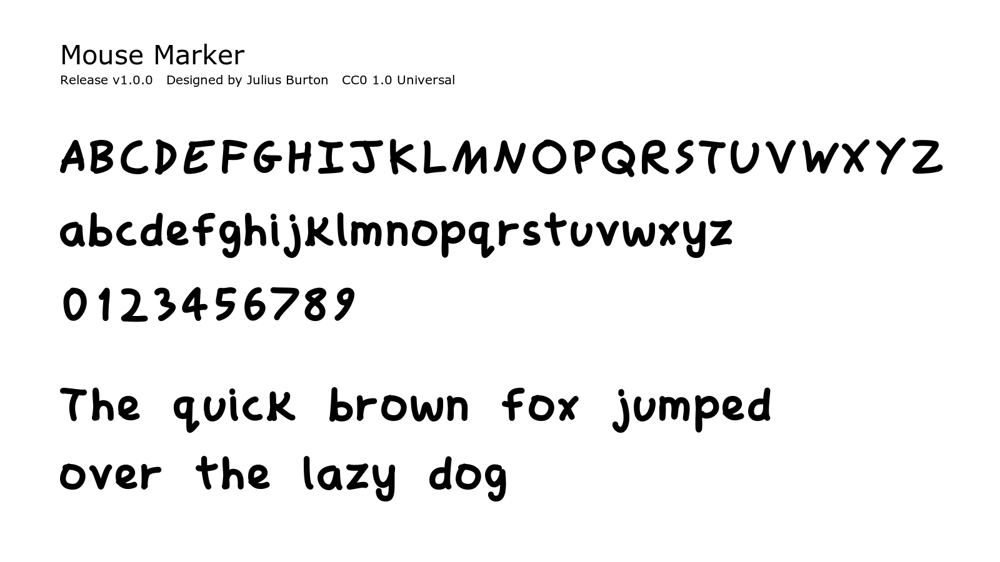

# Mouse Marker

Mouse Marker is a hand-drawn marker style typeface.

Designed by Julius Burton.

This repository publishes the `v1.0.0` release of Mouse Marker. The source art version for this release is `001.025`.



## License

Released under CC0 1.0 Universal.

You may:

- use
- modify
- redistribute
- bundle
- embed
- include it in commercial work

No attribution is required.

License URL: <https://creativecommons.org/publicdomain/zero/1.0/>

## Files

- `fonts/Mouse-Marker-Regular.otf` - desktop/installable font
- `fonts/Mouse-Marker-Regular.ttf` - compatibility build
- `fonts/Mouse-Marker-Regular.woff2` - web embedding build
- `source/Mouse-Marker-source.sfd` - FontForge source file
- `images/specimen.png` - preview specimen
- `scripts/build.py` - rebuilds the public release files

## Installation

Mac:
Double click the OTF file and select Install Font.

Windows:
Right click the OTF file and select Install.

## Web Usage

```css
@font-face {
  font-family: "Mouse Marker";
  src: url("Mouse-Marker-Regular.woff2") format("woff2");
  font-weight: 400;
  font-style: normal;
}

body {
  font-family: "Mouse Marker", sans-serif;
}
```

## Metadata Target

- Font Family: `Mouse Marker`
- Subfamily: `Regular`
- Full Name: `Mouse Marker Regular`
- PostScript Name: `MouseMarker-Regular`
- Designer: `Julius Burton`
- License: `CC0 1.0`
- License URL: `https://creativecommons.org/publicdomain/zero/1.0/`
